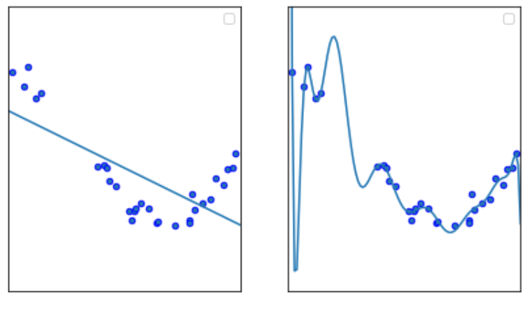

## Basic terminologies:

### Overfitting vs underfitting

The left figure below shows the fitting of data points by a linear function (polynomial with degree 1), which is not sufficient to fit the training samples. This is called underfitting i.e., the model is unable to learn the underlying structure of data. A nonlinear model such as a polynomial of higher degree approximates the true function almost perfectly. However, for higher degrees the model will overfit the training data, i.e. it learns the noise of the training data. Higher the overfitting, the less likely the model generalizes correctly from the data.

### Bias vs variance 

A low bias and a low variance are the two most desired features for a predictive model. Underfitting causes high bias, whereas overfitting of a model causes high variance. A simple linear algorithm might not fit training data well (high bias) but typically has the same performance with unseen data (low variance). A complex non-linear algorithm might fit the training data perfectly well (low bias)  but might have poor generalization capability (high variance). Consequently, we want our model to have enough degrees of freedom to resolve the underlying complexity of the data, but we also want it to not have too many degrees of freedom to avoid high variance. 

### Training-testing-validation

One way of avoiding overcoming the overfitting of data in machine learning is by splitting the dataset into training-testing-and validation. Training set is the set on which you run your learning algorithm on. Development set is used to tune parameters, select features, and make other decisions regarding the learning algorithm. It is also called the hold-out cross validation set. Test set is used to evaluate the performance of the algorithm, but not to make any decisions regarding what learning algorithm or parameters to use.
A general rule of thumb is to use a 60:20:20 ratio for training, dev, and test dataset, but it is normally driven by the size of your data set.

### Parameter vs hyperparameters

Parameters are learned from  data. Parameters are what we are after while we are fitting a model. In case of a simple linear model, intercept and slope coefficients are the parameters of the model that we estimate or learn from data.
Hyperparameter is related to algorithmic architecture but not data. For example, the degree of the polynomial to fit is a hyperparameter of a non-linear model. Hyperparameter is not estimated from data, but the nature of data guides the selection of the optimal hyperparameters. Some complex machine learning algorithms such as neural networks have many hyperparameters. Appropriate adjusting or tuning of hyperparameters is needed for optimal learning of model parameters.